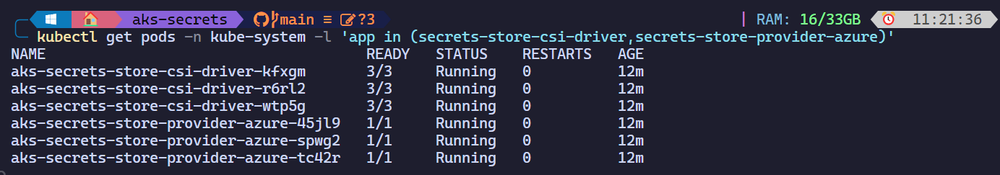

# Azure CSI Secrets Store Driver
Mounting Kubernetes Secrets from Azure Key Vault on AKS

<!---
comments goes here
-->

In the world of Kubernetes, managing secrets is a critical task. Whether it’s API keys, database credentials, or other sensitive information, securely storing and accessing secrets is essential for maintaining the integrity and security of your applications. The Azure CSI Secrets Store Driver provides an elegant solution to this challenge by seamlessly integrating with Azure Key Vault to manage secrets within your Kubernetes clusters.

In this post I'll show you how to use the Azure CSI Secrets Store Driver to mount secrets from Azure Key Vault on AKS. I'll also discuss the benefits of using this driver and how it can simplify secrets management in Kubernetes.

## Advantages of Using the Azure CSI Secrets Store Driver

1. Centralized Management: With the Azure CSI Secrets Store Driver, you can centralize your secrets management in Azure Key Vault. This means you no longer need to scatter secrets across different Kubernetes resources or worry about accidentally exposing them in configuration files.

1. Granular Access Control: Azure Key Vault allows you to define fine-grained access policies for secrets. By leveraging these policies, you can ensure that only authorized applications and services can retrieve specific secrets. The CSI driver respects these access controls, providing an additional layer of security.

1. Dynamic Secret Injection: Unlike traditional Kubernetes secrets, which require manual creation and management, the CSI driver dynamically injects secrets into pods at runtime. This dynamic provisioning simplifies secret rotation and ensures that your applications always have access to the latest credentials.

1. Transparent Integration: The Azure CSI Secrets Store Driver integrates seamlessly with existing Kubernetes workflows. You can reference secrets in your pod specifications just like regular Kubernetes secrets, making adoption straightforward for developers and operators.

1. Support for Multiple Secrets Providers: While Azure Key Vault is the primary provider, the CSI driver also supports other secret providers (such as HashiCorp Vault) through a pluggable architecture. This flexibility allows you to choose the right solution for your specific use case.

1. The Azure CSI Secrets Store Driver streamlines secrets management in Kubernetes by leveraging Azure Key Vault’s robust features while maintaining compatibility with existing workflows. Whether you’re running applications on-premises or in the cloud, this driver ensures that your secrets remain secure and accessible.


## AKS Cluster Setup

Before we can use the Azure CSI Secrets Store Driver, we need to create an AKS cluster. We'll use the Azure CLI to provision a new cluster with the following command:

```powershell
az aks create `
    --resource-group aksDemo `
    --name myAKSCluster `
    --enable-addons azure-keyvault-secrets-provider `
    --generate-ssh-keys
```

The add-on creates a user-assigned managed identity, `azureKeyvaultSecretsProvider`, to access Azure resources. We'll be using this UMI later to grant the CSI driver access to Azure Key Vault so make note of the client ID.


We can verify that the add-on was installed successfully by running the following command:

```bash
kubectl get pods -n kube-system -l 'app in (secrets-store-csi-driver,secrets-store-provider-azure)'
```



## RBAC Setup

Next we'll assign the UMI associated with the CSI driver to the `Key Vault Administrator` role for the Azure Key Vault instance. This will allow the driver to retrieve secrets from the vault. `Key Vault Administrator` isn't Least Privilege in the context of this demo, but it's to demonstrate that keys and certs can be retrieved from Key Vault, and rotated, without having to update the AKS cluster.

```powershell
$KEYVAULT_SCOPE = "$(az keyvault show --name myKeyVault577 --query id -o tsv)"

az role assignment create --role "Key Vault Administrator" --assignee d7015226-edc3-4e47-bd66-31170c8547f1 --scope $KEYVAULT_SCOPE
```

## Storage Class Setup

Now we'll create a secret storage class that will be used to mount secrets from Azure Key Vault. The storage class will reference the UMI we created earlier. We'll use the following YAML to create the storage class:

```yaml
apiVersion: secrets-store.csi.x-k8s.io/v1
kind: SecretProviderClass
metadata:
  name: azure-kvname-user-msi
spec:
  provider: azure
  parameters:
    usePodIdentity: "false"
    useVMManagedIdentity: "true"          # Set to true for using managed identity
    userAssignedIdentityID: d7015226-edc3-4e47-bd66-31170c8547f1   # Set the clientID of the user-assigned managed identity to use
    keyvaultName: myKeyVault577        # Set to the name of your key vault
    objects:  |
      array:
        - |
          objectName: ExampleSecret
          objectType: secret              # object types: secret, key, or cert
    tenantId: <tenant id>                 # The tenant ID of the key vault
```

We'll save this YAML as `storage-class.yaml` and apply it to the cluster with the following command:

```bash
kubectl apply -f storage-class.yaml
```

## Pod Setup

Finally, we'll create a pod that will use the storage class to mount a secret from Azure Key Vault. We'll use the following YAML to create the pod:

```yaml
kind: Pod
apiVersion: v1
metadata:
  name: busybox-secrets-store-inline-user-msi
spec:
  containers:
    - name: busybox
      image: registry.k8s.io/e2e-test-images/busybox:1.29-4
      command:
        - "/bin/sleep"
        - "10000"
      volumeMounts:
      - name: secrets-store01-inline
        mountPath: "/mnt/secrets-store"
        readOnly: true
  volumes:
    - name: secrets-store01-inline
      csi:
        driver: secrets-store.csi.k8s.io
        readOnly: true
        volumeAttributes:
          secretProviderClass: "azure-kvname-user-msi"
```

We'll save this YAML as `pod.yaml` and apply it to the cluster with the following command:

```bash
kubectl apply -f pod.yaml
```

## Verification

We can verify that the pod was created successfully by running the following command:

```bash
kubectl exec busybox-secrets-store-inline-user-msi -- cat /mnt/secrets-store/ExampleSecret
```


Note: The Azure Key Vault Provider for Secrets Store CSI Driver updates the pod mount and the Kubernetes secret defined in the secretObjects field of SecretProviderClass by polling for changes periodically, based on the rotation poll interval you defined. The default rotation poll interval is two minutes. Applications need to be designed to handle the rotation of secrets. For example, the application should watch for changes from the mounted Kubernetes Secret volume. Alternatively, the pod/deployment can be restarted to pick up the new secret value.

## Metrics

The Azure Key Vault Provider for Secrets Store CSI Driver exposes metrics in Prometheus format. The metrics are exposed on the /metrics endpoint on the driver pod. To read more about the metrics exposed by the driver, see: https://learn.microsoft.com/en-us/azure/aks/csi-secrets-store-driver#metrics-provided-by-the-secrets-store-csi-driver

## Conclusion

In this post I showed you how to use the Azure CSI Secrets Store Driver to mount secrets from Azure Key Vault on AKS. I also discussed the benefits of using this driver and how it can simplify secrets management in Kubernetes. If you'd like to learn more about the Azure CSI Secrets Store Driver, check out the following resources:

- [Azure CSI Secrets Store Driver Documentation](https://docs.microsoft.com/en-us/azure/aks/csi-secrets-store-driver)

Thanks for reading and happy coding!